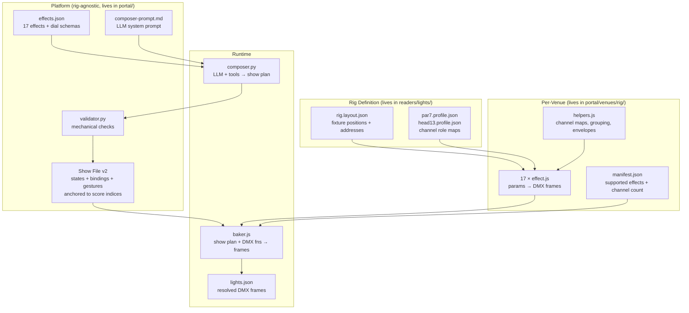

Here's every data structure in the system, laid out clearly.

---

## 1. Effect Catalog — `portal/effects.json`

The **platform-level** definition of all named effects. Rig-agnostic. This is the single source of truth for what effects exist.

```json
{
  "schema_version": 2,
  "dimensions": ["amount", "colour", "place", "rate"],
  "dial_types": {
    "amount":     { "type": "float",  "min": 0, "max": 1, "label": "Amount" },
    "colour":     { "type": "colour", "label": "Colour" },
    "colours":    { "type": "colour_pair", "label": "Colours" },
    "extent":     { "type": "enum", "values": ["all","inner","outer","ends","left","right","single"] },
    "for_beats":  { "type": "int",   "min": 1, "max": 64 },
    "over_beats": { "type": "int",   "min": 1, "max": 64 },
    "depth":      { "type": "float", "min": 0, "max": 1 },
    "curve":      { "type": "enum",  "values": ["linear", "ease", "settle"] },
    "travel":     { "type": "bool" },
    "stream":     { "type": "stream" },
    "streams":    { "type": "stream_pair" },
    "keep":       { "type": "fixture_set" },
    "which":      { "type": "fixture" }
  },
  "effects": [
    {
      "id":            "impact",              // unique key, used everywhere
      "name":          "Impact",              // human label
      "kind":          "gesture",             // "state" | "gesture" | "binding"
      "tier":          1,                     // 1 (core) or 2 (composed)
      "blurb":         "Amount to full...",   // one-sentence description
      "dimension":     "amount",              // which of the 4 it changes
      "returns":       true,                  // does it return to prior state?
      "dials": {                              // param schema — keys match dial_types
        "colour":     { "default": [1,1,1] },
        "extent":     { "default": "all" },
        "for_beats":  { "default": 1, "min": 1, "max": 4 }
      },
      "fires_on":      ["peak"],             // hints for the LLM composer
      "min_fixtures":  1,                     // refuse below this
      "requires":      ["colour", "level"],   // rig capabilities needed
      "optional":      ["move"],              // nice to have (e.g. lift.tilt)
      "default_beats": 1,                     // default duration when placed
      "span_anchors":  ["from_moment","to_moment"]  // only on ramp — two-anchor span
    }
  ]
}
```

**17 effects total.** 2 states (drone, wash), 12 gestures (impact, blackout, hush, ramp, stab, lift, trade, isolate, strip, cut, swell, gear), 3 bindings (follow, split, accent).

---

## 2. Venue Manifest — `portal/venues/<rig>/manifest.json`

Per-venue. Declares what the rig can do and which effects it supports.

```json
{
  "rig":                "club16-2head",
  "layout_file":        "club16-2head.layout.json",
  "total_channels":     138,
  "fixtures":           { "pars": 16, "heads": 2 },
  "supported_effects":  ["drone","wash","impact","blackout", ...all 17],
  "unsupported_effects": [],
  "limits": {
    "isolate_min_fixtures": 3
  }
}
```

---

## 3. DMX Function — `portal/venues/<rig>/<effect>.js`

One JS module per effect per venue. A **function** that takes params and context, returns DMX frames.

**Input:**
```js
function impact(params, ctx) {
  // params: the dials from the show file, defaults filled in
  //   { colour: [1,1,1], extent: "all", for_beats: 1 }
  //
  // ctx: rig context
  //   { fps: 40, bpm: 120, layout: <layout.json object> }
}
```

**Output (gesture/state):**
```js
{
  frames:      [[0,255,180,...], [0,230,160,...], ...],  // array of 138-value arrays
  loop_beats:  1,           // how many beats the frames cover (0 for states = static)
  per_fixture: ["par_01","par_02",...,"head_1","head_2"]  // which fixtures this drives
}
```

**Output (binding — follow/split/accent):**
```js
{
  frames:      [[...]],     // a single default frame
  loop_beats:  0,
  per_fixture: ["par_01",...],
  binding:     true,        // signals this is a binding
  render:      function(lane_value) { ... },  // called per-frame with live lane data
  smooth:      0.3          // smoothing factor (optional)
}
```

The `render(lane_value)` function takes a 0..1 float (for `follow`/`accent`) or a `[left, right]` pair (for `split`) and returns a single 138-value DMX frame.

---

## 4. Show File (v2) — `portal/shows/shw_*.show.json`

The **rig-agnostic** show file. Contains effect names + anchors + params. No DMX, no fixtures, no resolved colours. Plays on any venue that supports the effects.

**Current format (v1, still works):**
```json
{
  "id":            "shw_dba1742e8993",
  "version":       1,
  "author":        "dj 5nake",
  "name":          "randomshi",
  "song":          "raga-of-revenge",
  "seed":          1,
  "edits": [
    { "type": "blackout", "bar": 22, "beats": 4 }
  ],
  "designed_for": {
    "venue_id":   "ven_keycode",
    "venue_name": "KeyCode Stage",
    "layout":     "club16-2head.layout.json"
  }
}
```

**New format (v2, what the composer produces):**
```json
{
  "id":            "shw_abc123",
  "version":       1,
  "schema":        2,
  "author":        "model",
  "name":          "raga show",
  "song":          "raga-of-revenge",

  "plan":          "Devotional call and response. Moments 16 and 27 carry the whole show.",

  "states": [
    {
      "section":   0,               // index into the score's sections array
      "effect":    "drone",         // effect id from the catalog
      "amount":    0.12,            // dial overrides (keys match the effect's dials)
      "colour":    [1, 0.75, 0.35],
      "why":       "one voice and nothing else; leave somewhere to go"
    },
    {
      "section":   2,
      "effect":    "wash",
      "amount":    0.55,
      "colour":    [0.2, 0.4, 1],
      "why":       "full section, the groove is running"
    }
  ],

  "bindings": [
    {
      "section":   2,
      "effect":    "split",
      "streams":   ["lead-vocal", "back-vocal"],
      "colours":   [[1, 0.75, 0.35], [0.2, 0.4, 1]],
      "why":       "they alternate every 2.7s and overlap under 15%"
    },
    {
      "section":   3,
      "effect":    "follow",
      "stream":    "kick",
      "depth":     0.6,
      "extent":    "all",
      "why":       "the kick drives the room in the drop"
    }
  ],

  "gestures": [
    {
      "moment":      16,            // index into the score's moments array
      "effect":      "impact",
      "colour":      [1, 1, 1],
      "why":         "intensity 1.00; the one whole-rig moment in the song"
    },
    {
      "moment":      16,
      "lead_beats":  1,             // placed N beats BEFORE the moment
      "effect":      "blackout",
      "for_beats":   1,
      "why":         "the biggest moment earns the only silence before it"
    },
    {
      "from_moment": 11,            // span gesture: from moment 11 to moment 16
      "to_moment":   16,
      "effect":      "ramp",
      "to":          0.85,
      "curve":       "ease",
      "why":         "build into the peak"
    },
    {
      "moment":      27,
      "effect":      "lift",
      "by":          0.35,
      "tilt":        0.3,
      "why":         "a register shift is a rise, not a hit"
    }
  ],

  "designed_for": {
    "venue_id":   "ven_keycode",
    "venue_name": "KeyCode Stage",
    "layout":     "club16-2head.layout.json"
  }
}
```

**Key rules:**
- Every state anchors to a `section` index
- Every binding anchors to a `section` index and names `stream`/`streams` from the score
- Every gesture anchors to a `moment` index (or `from_moment`/`to_moment` for spans)
- `lead_beats` places a gesture N beats *before* its anchor moment
- Extra keys besides `effect`/`moment`/`section`/`why` are dial overrides, matched to the effect's `dials` schema
- The `why` field is the composer's reasoning, editable by the creator

---

## 5. Composer Output — what `POST /api/compose` returns

```json
{
  "plan": {                        // the cleaned show plan (same shape as show file v2 body)
    "plan":     "one sentence",
    "states":   [...],
    "bindings": [...],
    "gestures": [...]
  },
  "report": [                      // validation report
    { "level": "error", "msg": "gesture[2]: unknown effect 'foo'" },
    { "level": "warn",  "msg": "state[0]: no 'why'" },
    { "level": "warn",  "msg": "gesture[0] and gesture[1] overlap on dimension 'amount'" }
  ]
}
```

---

## 6. Baked Show — what `baker.js` outputs (`.lights.json`)

This is the **per-venue resolved** version. Contains actual DMX frames. Never saved as a show file — it's the ephemeral bake result that the player reads.

```json
{
  "rig":        "club16-2head",
  "layout":     "club16-2head.layout.json",
  "channels":   138,
  "fixtures":   [
    { "id": "par_01", "type": "par7", "address": 1, "at": [-3.375, 0, 2.9] },
    ...
  ],
  "style":      "limelight-v2",
  "fps":        40,
  "duration":   187.5,
  "tempo":      120,
  "beats":      [0.0, 0.5, 1.0, ...],
  "downbeats":  [0.0, 2.0, 4.0, ...],
  "sections":   [0.0, 15.3, 52.0, ...],
  "phases":     [
    { "start": 0.0,  "end": 15.3, "phase": "intro" },
    { "start": 15.3, "end": 52.0, "phase": "verse" }
  ],
  "moments":    [
    { "t": 52.26, "bar": 24, "kind": "peak", "what": "the loudest...", "weight": 1.0 }
  ],
  "frames":     [                  // one per tick at 40fps
    [0, 255, 180, 90, 0, 0, 0,    // par_01: master=0, R=255, G=180, B=90, ...
     0, 200, 140, 70, 0, 0, 0,    // par_02
     ...                           // total 138 values per frame
    ],
    ...
  ],
  "plan": {                        // the show plan that produced this, for UI display
    "text":     "Devotional call and response.",
    "states":   [...],
    "bindings": [...],
    "gestures": [...]
  }
}
```

The server strips `frames` out of this, packs them into a flat `Uint8Array` binary blob (`138 bytes × frame_count`), and serves it at `/api/frames/<job>.bin`. The player reads it at 40fps, indexed by the audio clock.

---

## 7. Layout File — `readers/lights/<rig>.layout.json`

The physical rig definition. Fixture positions, types, DMX addresses.

```json
{
  "layout":   "0.5",
  "rig":      "club16-2head",
  "geometry": "line",
  "frame":    "audience",
  "fixtures": [
    {
      "id":       "par_01",
      "type":     "par7",              // references a driver profile
      "at":       [-3.375, 0.0, 2.9],  // [x, y, z] metres, audience frame
      "universe": 0,
      "address":  1                     // 1-based DMX start address
    },
    ...
    {
      "id":       "head_1",
      "type":     "head13",
      "at":       [-2.6, 0.0, 3.2],
      "universe": 0,
      "address":  113
    }
  ],
  "limits": {
    "max_pan_per_frame":  7,
    "max_tilt_per_frame": 7
  }
}
```

---

## 8. Driver Profile — `readers/lights/drivers/profiles/<type>.profile.json`

The DMX channel truth for a fixture type. Referenced by the venue DMX functions.

**par7:**
```json
{
  "type":       "par7",
  "footprint":  7,
  "brightness": "colour",
  "can":        ["colour", "level", "strobe"],
  "channels": [
    { "role": "master",   "default": 255 },
    { "role": "colour.r", "default": 0 },
    { "role": "colour.g", "default": 0 },
    { "role": "colour.b", "default": 0 },
    { "role": "strobe",   "default": 0 },
    { "role": "keep_zero","default": 0 },
    { "role": "keep_zero","default": 0 }
  ]
}
```

**head13:**
```json
{
  "type":       "head13",
  "footprint":  13,
  "brightness": "master",
  "can":        ["colour", "level", "move", "strobe", "gobo", "prism"],
  "channels": [
    { "role": "pan" },  { "role": "pan_fine" },
    { "role": "tilt" }, { "role": "tilt_fine" },
    { "role": "speed" }, { "role": "master" }, { "role": "strobe" },
    { "role": "colour_wheel" }, { "role": "gobo" }, { "role": "prism" },
    { "role": "keep_zero" }, { "role": "keep_zero" }, { "role": "keep_zero" }
  ],
  "colour_wheel": [
    { "name": "white", "value": 4,   "rgb": [1,1,1] },
    { "name": "red",   "value": 20,  "rgb": [1,0,0] },
    ...
  ],
  "aim":  { "pan": [0, 169, 255], "tilt": [0, 40, 255] },
  "park": { "pan": 0.663, "tilt": 0.498, "level": 0, "speed": 0.784 }
}
```

---

## Relationships



That's every data structure. The show file (v2) is the portable thing — effect names + score anchors + dial overrides, no DMX. The venue's DMX functions are the rig-specific thing — they produce the actual byte values. The baked show is the ephemeral render, never saved as a show.